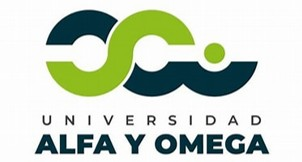

# Universidad Alfa y Omega - Gestión Académica y Administrativa



UAO GAA es un sistema de gestión escolar y administrativa para la Universidad Alfa y Omega. Este sistema está diseñado para ser utilizado por los profesores y administrativos de la universidad.

## Configuración recomendada del IDE

[VSCode](https://code.visualstudio.com/) + [Volar](https://marketplace.visualstudio.com/items?itemName=Vue.volar) (y desactivar Vetur).

## Soporte de Tipos para Importaciones de `.vue` en TS

TypeScript no puede manejar la información de tipos para importaciones de `.vue` por defecto, por lo que reemplazamos la CLI de `tsc` con `vue-tsc` para la verificación de tipos. En los editores, necesitamos [Volar](https://marketplace.visualstudio.com/items?itemName=Vue.volar) para que el servicio de lenguaje de TypeScript reconozca los tipos de `.vue`.

## Personalizar configuración

Ver [Referencia de Configuración de Vite](https://vite.dev/config/).

## Configuración del Proyecto

```sh
npm install
```

### Compilar y Recargar en Caliente para Desarrollo

```sh
npm run dev
```

### Verificar Tipos, Compilar y Minificar para Producción

```sh
npm run build
```

### Lint con [ESLint](https://eslint.org/)

```sh
npm run lint
```
